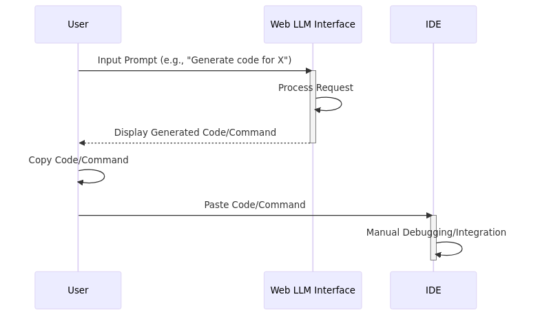
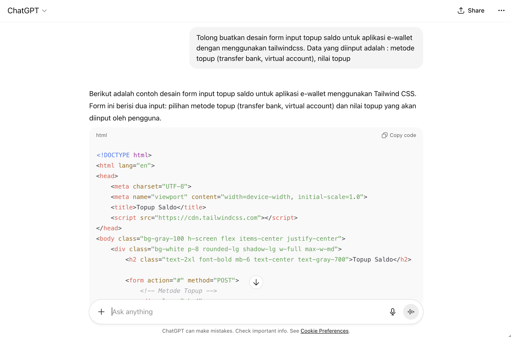
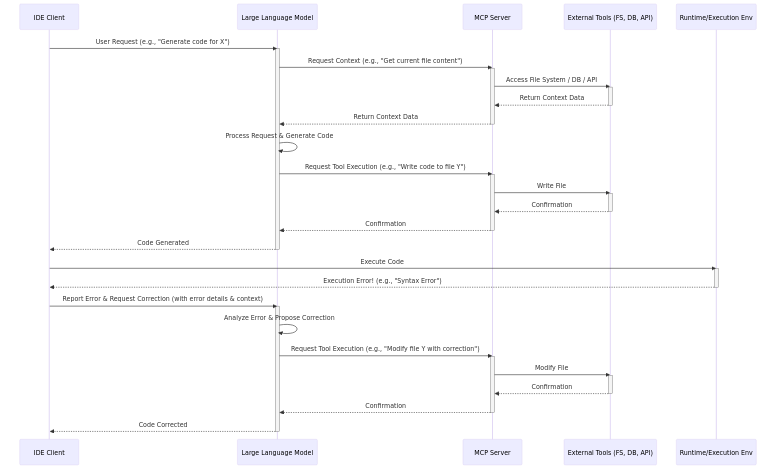
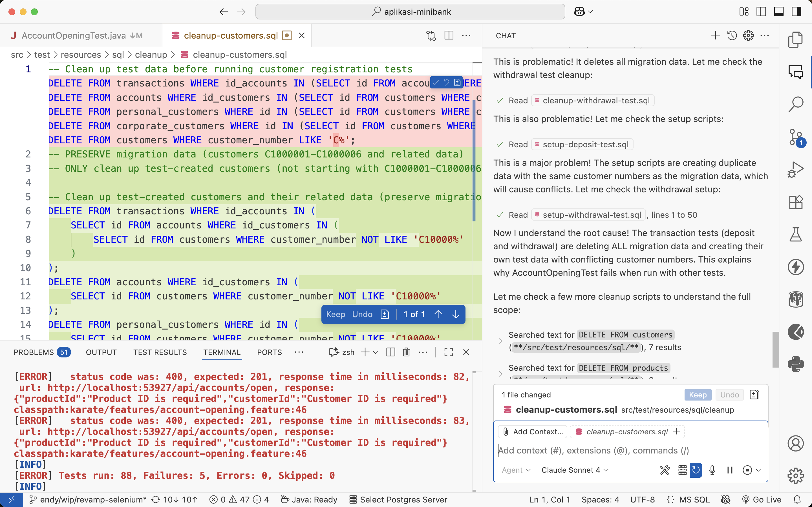
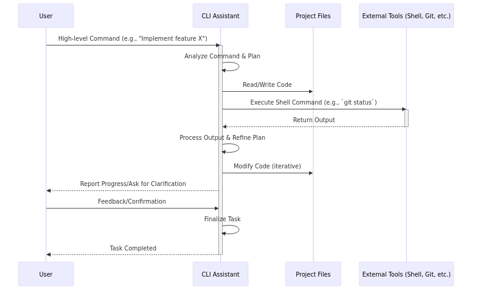
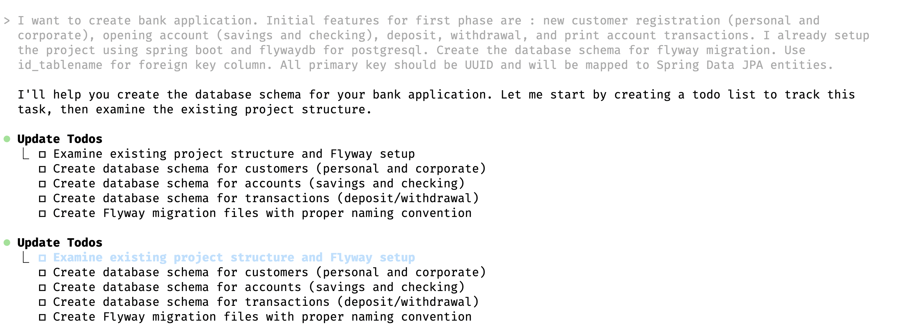
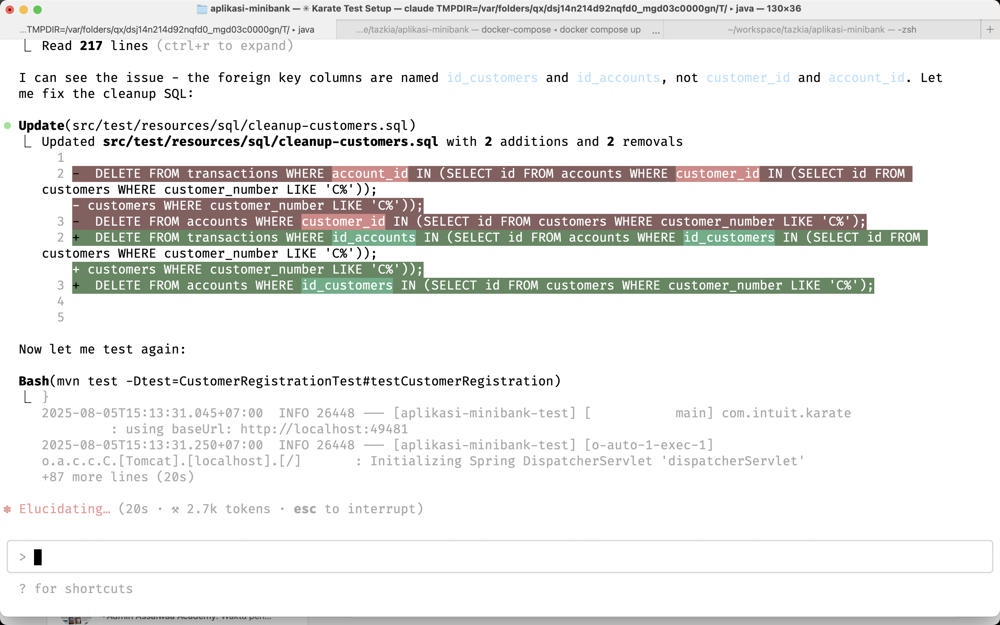
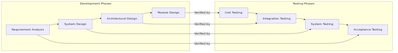

## 1. Tren Coding dengan AI (2024 - 2025)

---

### Evolusi: Era Copy-Paste (Nov 2024)

*   **Platform:** Web Chat (ChatGPT, Gemini)
*   **Workflow:** Manual (Prompt -> Copy -> Paste -> Debug)
*   **Keterbatasan:** Konteks minim & rawan error

---

### Diagram Era Copy-Paste

---

### Screenshot Era Copy-Paste

---

### Evolusi: Integrasi IDE (Feb 2025)

*   **Platform:** Ekstensi IDE (Roo Code, Cline)
*   **Kelebihan:** Memahami konteks dari basis kode

---

### Arsitektur Model Context Protocol (MCP)

*   **Konsep:** Standar komunikasi antara AI & IDE untuk berbagi konteks.
*   **Cara Kerja:** Klien (IDE) terhubung ke Server MCP yang menyediakan 'tools' (akses file, DB, dll).
*   **Manfaat:** Konteks lebih kaya untuk LLM, interoperabilitas, keamanan data.

---

### Diagram Arsitektur MCP

---

### Screenshot Integrasi IDE

---

### Evolusi: CLI Assistant (Juli 2025)

*   **Platform:** CLI (Gemini CLI, Claude Code)
*   **Kelebihan:** Otonom, dapat eksekusi perintah & I/O file
*   **Peran Developer:** Supervisor

---

### Diagram CLI Assistant

---

### Screenshot CLI Assistant [1]

---

### Screenshot CLI Assistant [2]

---

## 2. Workflow SDLC dengan AI

---

### Model V dalam Software Engineering

---

### A. Requirement & Test

*   **Proses Bisnis -> Spesifikasi**
    *   AI mengubah ide menjadi *user stories* & *use cases*.

*   **Spesifikasi -> Test Scenario**
    *   AI membuat *test cases* (happy path, edge cases, dll).

---

### B. Desain Aplikasi

*   **Arsitektur**
    *   AI merekomendasikan pola arsitektur & teknologi.

*   **Skema Database**
    *   AI membuat skema SQL/NoSQL dari model domain.

---

### C. Desain Implementasi

*   **Class Diagram**
    *   AI mengidentifikasi kelas, atribut, dan relasi.

*   **Sequence Diagram**
    *   AI memvisualisasikan interaksi antar komponen.

---

### D. Coding dengan AI (CLI Assistant)

*   **Peran AI:**
    *   Menerima instruksi dari developer.
    *   Membuat/memodifikasi kode.
    *   Menjalankan tes & debugging.
    *   Melakukan refactoring.
*   **Peran Developer:**
    *   Memberikan instruksi yang jelas.
    *   Mereview & memverifikasi hasil kerja AI.
    *   Membuat keputusan arsitektur & desain tingkat tinggi.

---

### E. Testing dengan AI

*   **Automated Test Generation:**
    *   **Unit Test:** AI membuat tes untuk fungsi/metode individual.
    *   **Integration Test:** AI merancang tes untuk interaksi antar komponen.
    *   **Functional Test:** AI menghasilkan skenario tes end-to-end berdasarkan spesifikasi.
*   **Test Data Generation:**
    *   AI membuat data uji yang realistis dan beragam.
*   **Defect Detection & Reporting:**
    *   AI membantu mengidentifikasi potensi cacat & menghasilkan laporan tes.

---

### F. CI/CD dengan AI

*   **Script Generation:**
    *   AI membuat script CI/CD untuk platform seperti GitLab CI, GitHub Actions, Jenkins, dll.
    *   Mengkonfigurasi pipeline untuk build, test, deploy.
*   **Optimasi Pipeline:**
    *   AI menganalisis & merekomendasikan optimasi untuk efisiensi pipeline.
*   **Troubleshooting:**
    *   AI membantu mendiagnosis kegagalan CI/CD & menyarankan perbaikan.

---

### G. Infrastructure as Code (IaC) dengan AI

*   **Generasi Konfigurasi:**
    *   AI membuat script IaC (Terraform, Ansible, CloudFormation) dari deskripsi high-level.
*   **Validasi & Optimasi:**
    *   AI memvalidasi konfigurasi IaC untuk kepatuhan & keamanan.
    *   Merekomendasikan optimasi biaya & performa.
*   **Manajemen Perubahan:**
    *   AI membantu mengelola perubahan infrastruktur & mencegah *drift*.

---

### H. DevSecOps dengan AI

*   **Integrasi Keamanan Dini:**
    *   AI mengintegrasikan praktik keamanan ke setiap tahap SDLC (Shift-Left Security).
*   **Vulnerability Scanning Otomatis:**
    *   AI mengidentifikasi kerentanan dalam kode, dependensi, dan konfigurasi secara otomatis.
*   **Threat Detection & Response:**
    *   AI mendeteksi anomali & potensi ancaman keamanan secara real-time dalam pipeline CI/CD dan produksi.
    *   Mengotomatisasi respons terhadap insiden keamanan.
*   **Compliance & Governance:**
    *   AI memastikan kepatuhan terhadap standar keamanan & regulasi dengan audit otomatis.
*   **Keamanan IaC:**
    *   AI memvalidasi konfigurasi Infrastructure as Code (IaC) untuk celah keamanan.

---

### I. Ringkasan Kontribusi AI dalam SDLC (Bagian 1)

| Tahap Development | Kontribusi AI |
| :---------------- | :------------ |
| A. Requirement & Test | Mengubah ide ke user stories & test cases. |
| B. Desain Aplikasi | Rekomendasi arsitektur & teknologi, skema database. |

---

### J. Ringkasan Kontribusi AI dalam SDLC (Bagian 2)

| Tahap Development | Kontribusi AI |
| :---------------- | :------------ |
| C. Desain Implementasi | Identifikasi kelas, atribut, relasi, visualisasi interaksi. |
| D. Coding dengan AI | Membuat/modifikasi kode, tes & debugging, refactoring. |

---

### K. Ringkasan Kontribusi AI dalam SDLC (Bagian 3)

| Tahap Development | Kontribusi AI |
| :---------------- | :------------ |
| E. Testing dengan AI | Generasi automated test (unit, integrasi, fungsional), data uji, deteksi cacat. |
| F. CI/CD dengan AI | Generasi script CI/CD, optimasi pipeline, troubleshooting. |

---

### L. Ringkasan Kontribusi AI dalam SDLC (Bagian 4)

| Tahap Development | Kontribusi AI |
| :---------------- | :------------ |
| G. Infrastructure as Code (IaC) dengan AI | Generasi script IaC, validasi & optimasi konfigurasi, manajemen perubahan. |

---

### M. Ringkasan Kontribusi AI dalam SDLC (Bagian 5)

| Tahap Development | Kontribusi AI |
| :---------------- | :------------ |
| H. DevSecOps dengan AI | Integrasi keamanan dini, scanning kerentanan, deteksi ancaman, kepatuhan, keamanan IaC. |

---

## 3. Tahapan Migrasi

---

### Langkah-langkah Adopsi

1.  **Eksplorasi:**
    *   Coba berbagai mode: Web, IDE, CLI.
    *   Pahami kapabilitas & batasan.

2.  **Pilot Project:**
    *   Gunakan *cloud-based AI* pada proyek non-kritis.
    *   Ukur produktivitas & kualitas.

3.  **Infrastruktur Local LLM:**
    *   Evaluasi kebutuhan LLM lokal untuk keamanan & kustomisasi.

4.  **Adopsi Penuh:**
    *   *Fine-tune* model dengan data internal.
    *   Jadikan AI sebagai standar workflow.

---

## 4. Hands-on Practices

*   Requirement Development
*   Test Scenario
*   Coding
*   CI/CD

---

## Sesi Diskusi