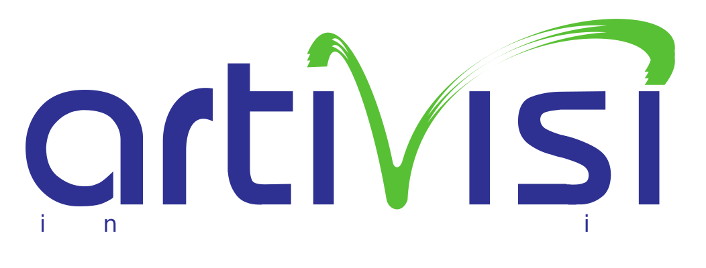

---

## 1. Tren Coding dengan AI (2024 - 2025)

---

### Evolusi: Era Copy-Paste (Nov 2024)

*   **Platform:** Web Chat (ChatGPT, Gemini)
*   **Workflow:** Manual (Prompt -> Copy -> Paste -> Debug)
*   **Keterbatasan:** Konteks minim & rawan error

---

### Diagram Era Copy-Paste

---

### Screenshot Era Copy-Paste

---

### Evolusi: Integrasi IDE (Feb 2025)

*   **Platform:** Ekstensi IDE (Roo Code, Cline)
*   **Kelebihan:** Memahami konteks dari basis kode

---

### Arsitektur Model Context Protocol (MCP)

*   **Konsep:** Standar komunikasi antara AI & IDE untuk berbagi konteks.
*   **Cara Kerja:** Klien (IDE) terhubung ke Server MCP yang menyediakan 'tools' (akses file, DB, dll).
*   **Manfaat:** Konteks lebih kaya untuk LLM, interoperabilitas, keamanan data.

---

### Diagram Arsitektur MCP

---

### Screenshot Integrasi IDE

---

### Evolusi: CLI Assistant (Juli 2025)

*   **Platform:** CLI (Gemini CLI, Claude Code)
*   **Kelebihan:** Otonom, dapat eksekusi perintah & I/O file
*   **Peran Developer:** Supervisor

---

### Diagram CLI Assistant

---

### Screenshot CLI Assistant

---

## 2. Workflow SDLC dengan AI

---

### Model V dalam Software Engineering

---

### A. Requirement & Test

*   **Proses Bisnis -> Spesifikasi**
    *   AI mengubah ide menjadi *user stories* & *use cases*.

*   **Spesifikasi -> Test Scenario**
    *   AI membuat *test cases* (happy path, edge cases, dll).

---

### B. Desain Aplikasi

*   **Arsitektur**
    *   AI merekomendasikan pola arsitektur & teknologi.

*   **Skema Database**
    *   AI membuat skema SQL/NoSQL dari model domain.

---

### C. Desain Implementasi

*   **Class Diagram**
    *   AI mengidentifikasi kelas, atribut, dan relasi.

*   **Sequence Diagram**
    *   AI memvisualisasikan interaksi antar komponen.

---

## 3. Tahapan Migrasi

---

### Langkah-langkah Adopsi

1.  **Eksplorasi:**
    *   Coba berbagai mode: Web, IDE, CLI.
    *   Pahami kapabilitas & batasan.

2.  **Pilot Project:**
    *   Gunakan *cloud-based AI* pada proyek non-kritis.
    *   Ukur produktivitas & kualitas.

3.  **Infrastruktur Local LLM:**
    *   Evaluasi kebutuhan LLM lokal untuk keamanan & kustomisasi.

4.  **Adopsi Penuh:**
    *   *Fine-tune* model dengan data internal.
    *   Jadikan AI sebagai standar workflow.

---

## 4. Hands-on Practices

*   Requirement Development
*   Test Scenario
*   Coding
*   CI/CD

---

## Terima Kasih & Diskusi

